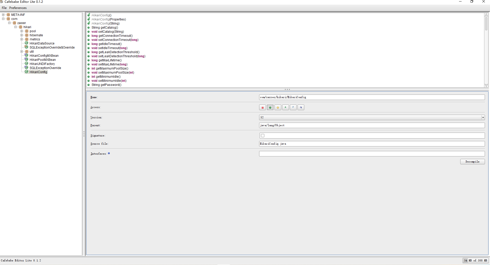

# 0xCafebabe
0xCafebabe
## 原项目地址
[Cafebabe](https://github.com/GraxCode/Cafebabe)

## 类库
+ JDK: AdoptOpenJDK 11.0.7.10
+ WebLaf: 1.2.13
+ JGraphx: 3.4.1.3
+ CFR: 0.151

## 改进
+ 引进Gradle来管理项目的类库 √
+ 中文支持 √
+ 汉化 x  
+ 图形类库升级 √ 
+ 其他类库升级 √
+ 功能改进 x

## 问题
若干，部分方法过时无法使用，现在为了项目能够顺利启动，姑且进行了最低程度的注释。

## 使用方法
下载该项目源代码，使用Gradle编译成jar文件

## 截图
